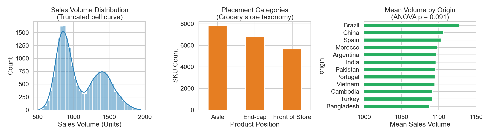
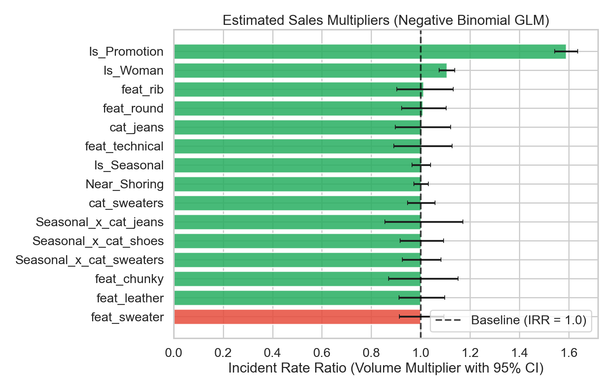
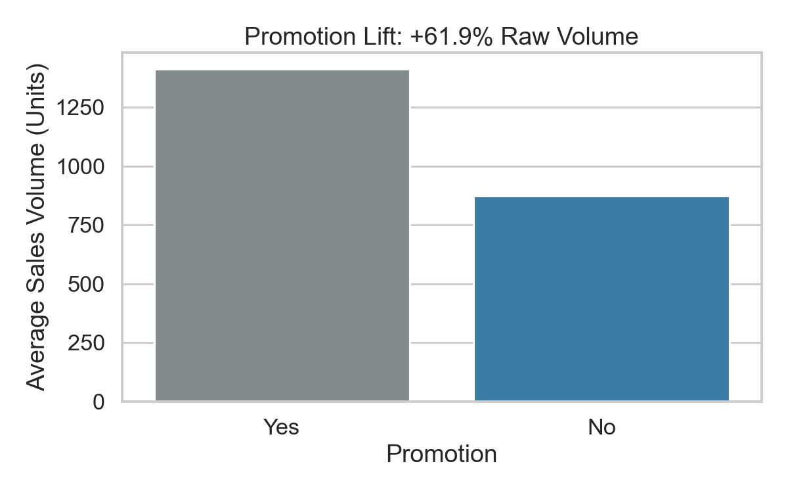
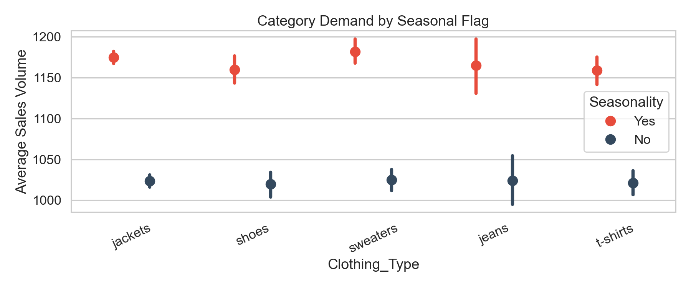
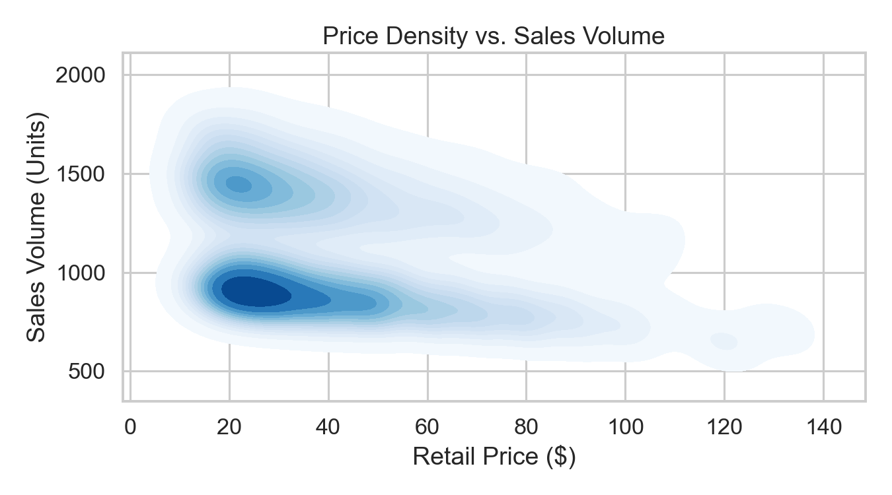

# Zara Sales Analysis: Commercial Data Audit & Econometric Modeling

This project is a commercial data audit and econometric modeling case study on the widely circulated Kaggle Zara sales dataset. 

Rather than taking the data at face value, this analysis evaluates whether the underlying figures reflect real-world fast-fashion retail operations, exposes where standard machine-learning approaches extract false signals from synthetic data, and details what retail analytics teams actually need to guide commercial decisions.

---

## The Core Problem: Synthetic Data vs. Retail Reality

Standard modeling exercises on this dataset often claim to discover strategic sales multipliers, such as specific fabric descriptors or near-shoring advantages. A preliminary data audit shows these findings are based on synthetic artifacts rather than real consumer behavior:

| Data Check | Observed in Dataset | Real Retail Baseline | Commercial Assessment |
| :--- | :--- | :--- | :--- |
| **Sales Volume Distribution** | Artificially bounded between 518 and 1,940 units (mean: 1,097; normal-like curve). | SKU sales follow a steep Pareto / power-law curve (a small share of SKUs drives most volume; high zero-sales rate). | **Synthetic Artifact:** The numbers reflect an artificial generator, not true market demand. |
| **Merchandising Attributes** | Product position uses "Aisle" and "End-cap". | Fast-fashion stores merchandise by collection, trend story, and display tables. | **Domain Mismatch:** Supermarket grocery terminology mistakenly applied to an apparel catalog. |
| **Sourcing Origin** | Average sales across 12 countries are nearly identical (1,095 to 1,106 units). One-way ANOVA: F = 1.60, p = 0.091. | Near-shoring (Spain, Portugal, Morocco) is used for speed and margin protection, not consumer brand preference. | **Statistical Noise:** Sourcing origin differences are statistically indistinguishable from random noise (p > 0.05). |
| **Unit Economics** | No cost of goods sold (COGS), discount depth, or return tracking. | Profitability depends on gross margin percentage, markdown management, and return logistics. | **Missing Foundation:** Analyzing unit volume without margins risks optimizing for unprofitable sales. |



---

## Econometric Modeling (Negative Binomial GLM)

To evaluate the relationships correctly, we fit a Negative Binomial Generalized Linear Model (log-link) to account for discrete, overdispersed count data.

### Model Summary
* **Deviance:** 179.74
* **Scale / Dispersion:** 1.000
* **Target:** Sales Volume

| Feature | Incident Rate Ratio (IRR) | 95% Confidence Interval | p-value | Commercial Interpretation |
| :--- | :--- | :--- | :--- | :--- |
| **Promotion (Yes vs. No)** | 1.589 (+58.9%) | [1.543, 1.636] | < 0.001 | Strong volume lift, but requires margin context to verify profitability. |
| **Section (Women vs. Men)** | 1.106 (+10.6%) | [1.074, 1.138] | < 0.001 | Structural baseline demand premium in the Women's division. |
| **Log Price** | 0.887 (-11.3%) | [0.875, 0.900] | < 0.001 | Predictable volume drop as price tiers increase. |
| **Near-Shoring (Yes vs. No)** | 1.001 (+0.1%) | [0.972, 1.031] | 0.932 | Statistically insignificant. No evidence that origin drives volume. |
| **Description Term: "technical"** | 1.002 (+0.2%) | [0.892, 1.127] | 0.969 | Statistically insignificant. Copywriting terms do not predict sales. |
| **Description Term: "rib"** | 1.011 (+1.1%) | [0.903, 1.131] | 0.852 | Statistically insignificant. |



---

## Commercial Analysis: The Promotion Margin Trap

The model identifies a 1.59x (+58.9%) volume lift for promoted items. In retail operations, maximizing unit volume through discounts without margin controls frequently erodes total profit:

1. **Margin Dilution:** If an item with a 60% gross margin is discounted by 30%, gross margin dollars per unit fall by 50%. Unit volume must double (+100%) simply to match pre-promotion gross profit dollars. A +58.9% lift results in an approximate 20% loss in total gross profit.
2. **Reverse Logistics:** Apparel e-commerce experiences 20% to 35% return rates. Pushing volume via promotions inflates return processing costs and inventory depreciation.

| Promotion Volume Lift | Seasonal Distribution | Price vs. Volume Density |
| :--- | :--- | :--- |
|  |  |  |

---

## Repository Structure

* `Zara_Sales_Analysis.ipynb`: Master analysis notebook covering data auditing, model specification, diagnostics, and category-level segmentation.
* `Strategic_Sales_Insights.md`: Executive-level briefing memo outlining commercial risks, data governance takeaways, and KPI recommendations.
* `assets/`: Charts and diagnostic plots referenced in the documentation.
* `pyproject.toml`: Environment configuration and dependencies.

---

## Getting Started

1. **Clone the repository:**
   ```bash
   git clone https://github.com/Abraham-Babs/Zara_Sales_analysis.git
   cd Zara_Sales_analysis
   ```

2. **Install dependencies:**
   Using `uv`:
   ```bash
   uv sync
   ```

3. **Run the analysis:**
   ```bash
   uv run jupyter lab Zara_Sales_Analysis.ipynb
   ```
